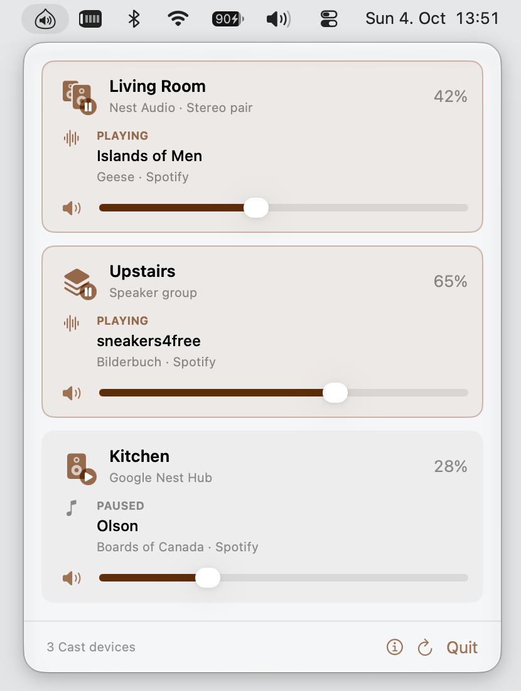

# Castagno

A tiny macOS menu bar app for Google Cast speakers, stereo pairs, and groups. Adjust volume, mute, pause/resume, and see what's playing.



## Install

Requires macOS 13+ on Apple Silicon.

```sh
brew install --cask lxgr/tap/castagno
```

Releases are ad-hoc signed and not notarized; remove the quarantine flag manually when downloading manually instead of using the Homebrew cask.

## Build

Requires Xcode Command Line Tools with Swift 5.9+.

```sh
./scripts/build-app.sh
```

The app is built into `dist/Castagno.app`.

See [the documentation](docs/INDEX.md) for development, CLI commands, troubleshooting, and future explorations.

[MIT](LICENSE) · Built with [OpenCastSwift](https://github.com/SuperMarcus/OpenCastSwift) · [Third-party licenses](THIRD-PARTY-NOTICES.txt)
