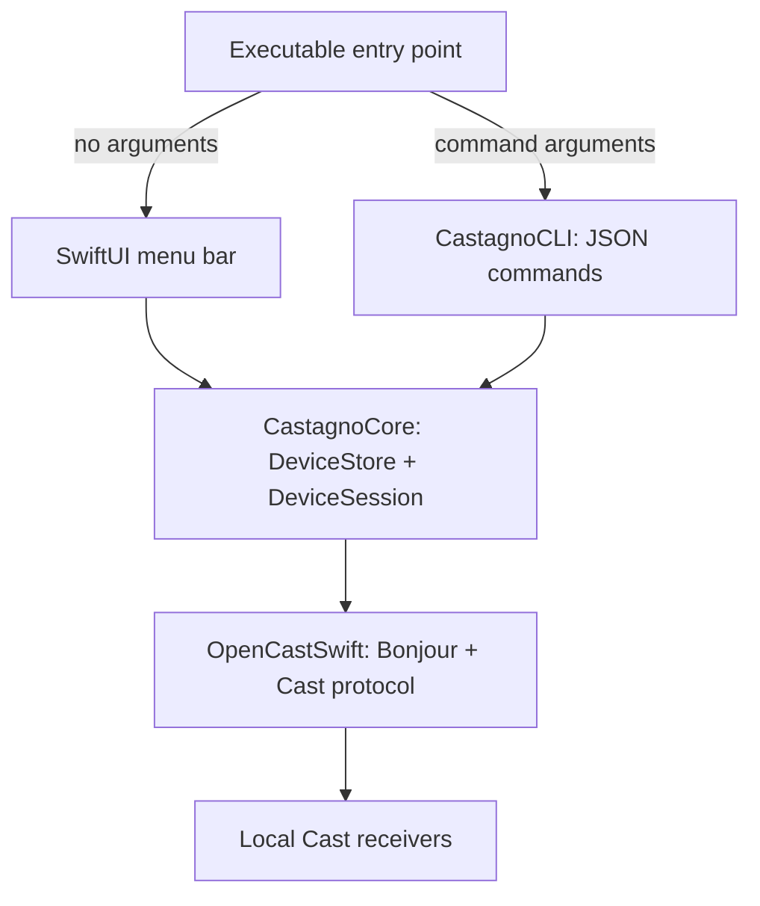

# Castagno architecture

`CastagnoCore` is a library target with no AppKit or SwiftUI dependency. It owns discovery, connection lifecycle, confirmed volume/mute values, media observation, group membership filtering, and playing-first ordering. Observable sessions support the UI; Codable snapshots provide a stable value API for automation. All operations run on the main thread/run loop because Bonjour and OpenCastSwift use scheduled streams.

`DeviceStore.demo()` provides an interactive fictional scene without scanning Bonjour, creating Cast clients, or probing receiver membership. Demo sessions take local control paths and expose the same observable state and snapshots as real sessions; they share playback sorting and interaction holds. Refresh replaces the scene with its original fixtures. The executable's standalone `--demo` argument starts the menu bar GUI with this store, without persisting a mode preference.

`DiscoveryProgress` exposes searching, resolving, monitoring, failed, and stopped phases plus service counts. Scanner events update devices and progress immediately; after two seconds without pending resolutions, initial discovery settles while Bonjour continues watching. Core tests can supply a scanner and session factory to verify discovery/lifecycle behavior without a GUI or live receivers.

`GroupMembershipProbe` reads each physical receiver's local setup membership. Explicit multichannel plus left/right assignments distinguish stereo pairs from ordinary groups; member count and matching models are insufficient. `ReceiverKind` supplies the user-facing category while the underlying `CastDevice.isGroup` preserves protocol behavior. Both the UI and JSON snapshots use this shared classification and display label.

`CastagnoCLI` parses bounded commands and drives the core on a Foundation run loop. It emits JSON snapshots on stdout, diagnostics/errors on stderr, and nonzero exit codes for invalid commands, discovery failures, or unconfirmed controls. The executable chooses CLI mode before constructing the SwiftUI app, so CLI mode needs no GUI registration or Computer Use.

The menu bar and CLI are separate processes using the same core implementation. CLI commands discover receivers directly; they do not depend on the GUI process being open. `--all` exposes group members for debugging or individual controls. Mutating commands identify devices by stable ID and verify receiver-reported values, rather than optimistic slider state. `DeviceSession.setPlaying` and `togglePlayback` pause/resume existing media, with receiver confirmation, duplicate-command protection, and timeout handling. Network permissions still apply to either entry point.

The `CastagnoTests` target imports the core and CLI libraries directly. It exercises framing, receiver commands, group membership, playback metadata and ordering, CLI validation, and JSON serialization without linking the UI target. The separate `CastagnoLayoutTests` target hosts the popover with a fake scanner and sessions, checking its first-opening minimum size without Computer Use or live network access. Real-device behavior can be checked with `list` and a bounded `watch` instead of clicking the menu bar.
